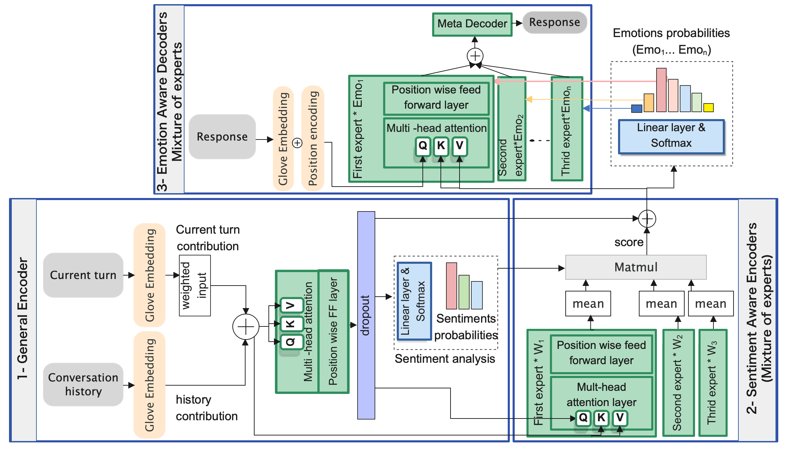

## ASEM: Enhancing Empathy in Chatbot through Attention-based Sentiment and Emotion Modeling
Accepted at LREC-COLING 2024

This is the PyTorch implementation of the paper:

**ASEM: Enhancing Empathy in Chatbot through Attention-based Sentiment and Emotion Modeling**.  ***LREC-COLING 2024*** 

<!-- [[PDF]](https://arxiv.org/pdf/1908.07687.pdf) -->

If you use any source codes or datasets included in this toolkit in your work, please cite the following paper. The bibtex is listed below:
<pre>
@article{hamad2024asem,
  title={ASEM: Enhancing Empathy in Chatbot through Attention-based Sentiment and Emotion Modeling},
  author={Hamad, Omama and Hamdi, Ali and Shaban, Khaled},
  journal={arXiv preprint arXiv:2402.16194},
  year={2024}
}
</pre>

## Abstract
Effective feature representations play a critical role in enhancing the performance of text generation models that rely on deep neural networks. However, current approaches suffer from several drawbacks, such as the inability to capture the deep semantics of language and sensitivity to minor input variations, resulting in significant changes in the generated text. In this paper, we present a novel solution to these challenges by employing a mixture of experts, multiple encoders, to offer distinct perspectives on the emotional state of the user’s utterance while simultaneously enhancing performance. We propose an end-to-end model architecture called ASEM that performs emotion analysis on top of sentiment analysis for open-domain chatbots, enabling the generation of empathetic responses that are fluent and relevant. In contrast to traditional attention mechanisms, the proposed model employs a specialized attention strategy that uniquely zeroes in on sentiment and emotion nuances within the user's utterance. This ensures the generation of context-rich representations tailored to the underlying emotional tone and sentiment intricacies of the text. Our approach outperforms existing methods for generating empathetic embeddings, providing empathetic and diverse responses. The performance of our proposed model significantly exceeds that of existing models, enhancing emotion detection accuracy by 6.2\% and lexical diversity by 1.4\%.

## ASEM Architecture:
<p align="center">

</p>

## Emotion Detection 

<p align="center">

</p>

Confusion matrix for ASEM model for emotion analysis using ED dataset (0: Anger, 1: Fear, 2: Sadness, 3: Remorse, 4: Surprise, 5: Disgust, 6: Joy, 7: Anticipation, 8: Love, 9: Trust ).

## Dependency
Check the packages needed or simply run the command
```console
pip install -r requirements.txt
```
[**Pre-trained glove embedding**](http://nlp.stanford.edu/data/glove.6B.zip): ***glove.6B.300d.txt*** inside folder /vectors/.

Obtain the preprocessed data (.npy files) by accessing the empathetic-dialogue folder at [**this link**](https://drive.google.com/drive/folders/1q06aGAzUt7LcQ1iwR_zs_65Y6Pyiss5R?usp=sharing) and use it to overwrite the current folder.


## Results

Please check the folder ***Evaluated answers*** for the human annotation and the folder ***Generated-Responses-testset*** for all the generated responses

## Dataset

The Empathetic Dialogue and DailyDialog datasets have been preprocessed and stored in the .npy format in [**this link**](https://drive.google.com/drive/folders/1q06aGAzUt7LcQ1iwR_zs_65Y6Pyiss5R?usp=sharing). This setup encompasses arrays for the entire conversation context, target responses, the user's current turn, the history of the conversation (excluding the current turn), as well as emotion and sentiment labels. The script used for preprocessing will be released shortly.

## Training & Testing

Run main.py
```console
python3 main.py --model experts  --label_smoothing --noam --emb_dim 300 --hidden_dim 300 --hop 12 --heads 10 --topk 7 --cuda --pretrain_emb --softmax  --mean_query --schedule 10000 --save_path save/asem/ --basic_learner --topk_stn 2

```

To test the pretrained "ASEM_model.pth", you can download it from [**this link**](https://drive.google.com/drive/folders/1q06aGAzUt7LcQ1iwR_zs_65Y6Pyiss5R?usp=sharing) and include the command `--test`.


## Using DD dataset
To adapt the code for testing with either the ED or DD datasets, follow these instructions:

For the DD (Daily Dialogue) dataset:
1. Navigate to the `data_reader.py` file. Locate the section labeled "Daily Dialogue dataset (DD)." Uncomment this section and comment out any preceding code blocks related to dataset configuration.

For adjustments in `data_loader.py`:
1. Uncomment lines 31 and 36, which pertain to `sent_map` and `emo_map` respectively.
2. Comment out lines 29 and 34 to disable the previous settings for `sent_map` and `emo_map`.

When executing the run command:
1. Modify the parameter `--topk_stn` from 2 to 3.
2. Adjust the `--topk` parameter from 7 to 6.

These changes ensure compatibility with the DD dataset and optimize the code for its specific structure and requirements.

## Important Note on Terminology

Please be aware that within the codebase, the term "stance" is frequently used in variable names, comments, and documentation. Initially, the project was designed to analyze and categorize stances within textual data. However, as the project evolved, the focus shifted towards sentiment analysis.

Despite this change in functionality, the original term "stance" was retained in various parts of the code to maintain consistency and avoid extensive refactoring. Therefore, when you encounter the term "stance" in variables, comments, or any part of the code, it should be understood as referring to "sentiment."

## Demo
Coming soon.

## Contact Information
* Omama Hamad: omama.hamad@qu.edu.qa